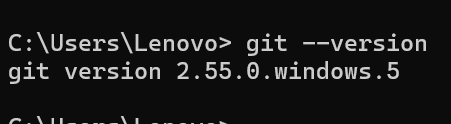
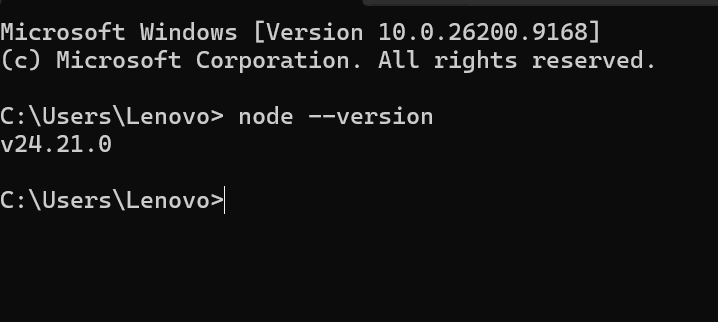
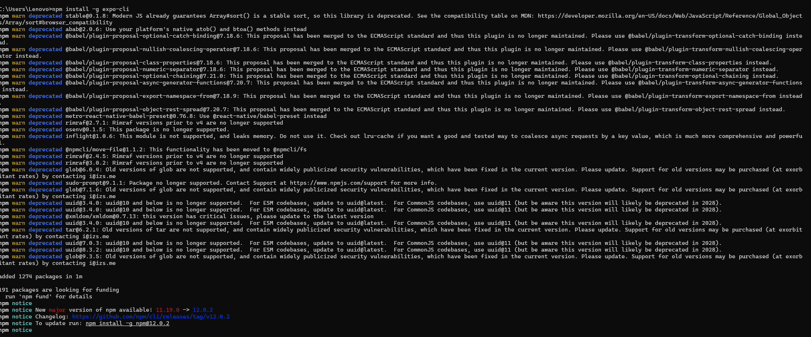
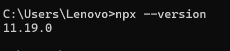
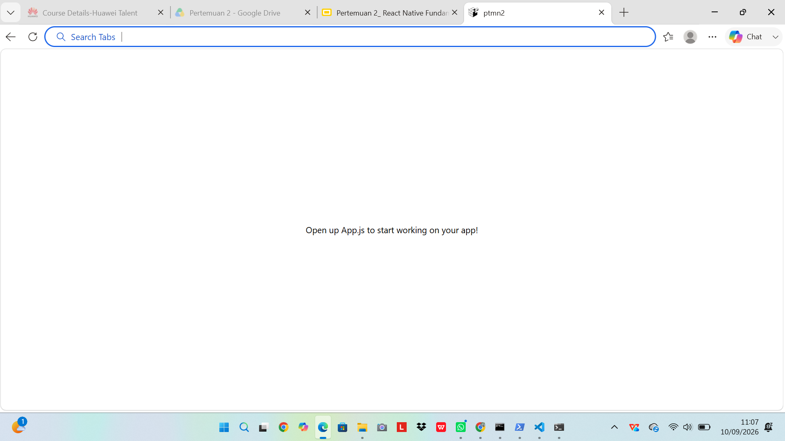
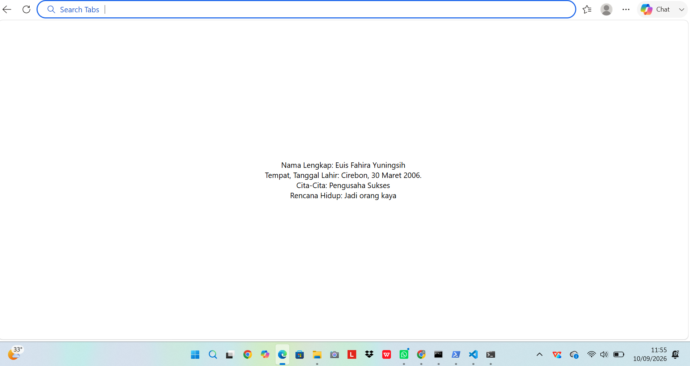

# **Praktikum Mentiapkan Memulai Pemrograman Mobile dengan React Native**

## **Tujuan Pembelajaran**

setelah menyelesaikan modul praktikum ini, mahasiswa diharapkan mampu:

- Menginstal Git dan Github
- Menginstal Node.js dan NPM
- Menginstal Expo CLI
- Membuat project React Native
- Menjalankan project React Native

1. Instal Git di local

   - unduh dan instal Git Via https://git-scm.com/install/windows
   - Verifikasi Git (buka CMD dan ketik "git--version")
     

2. Instal Node JS

   - unduh dan instal Node JS via https://nodejs.org/en/download
   - Verifikasi Node JS (buka CMD dan ketik "node --version" "npm --version")
     

3. Memulai projek dengan Framwork Expo

   - Buka terminal pada code editor
   - patikan aktif di directory yang dituju
   - ketikan (npx create-expo-app ptm2 --template blank)
   - tunggu hingga proses install selesai
   - projek selesai
     

4. Menjalankan Projek React Native

   - Masuk ke directory projek (cd ptmn2)
   - jalankan projek (npx exxpo strat)
   - Scan QR code dengan Aplikasi Expo Go
   - jika ingin run emulator di WEB ketik w
   - di terminal "npx expo install react- dom react-native-web"
   - npx expo start --web
   
   

5. LATIHAN PERTEMUAN-2
   - tambahkan teks berupa:
   - Nama Lengkap
   - Tempat Tanggal Lahir
   - Cita-Cita
   - Renacana Hidup
   
